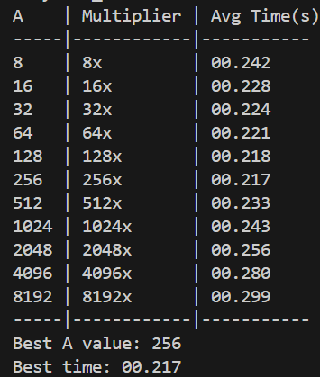
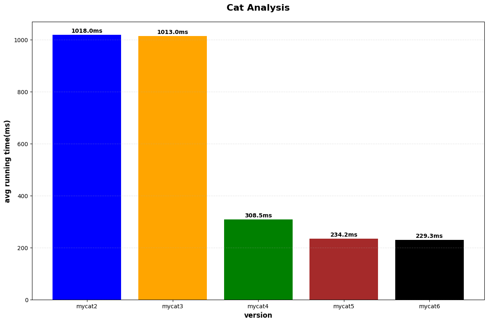

# Meowlab实验报告

| 姓名 | 学号       |
| ---- | ---------- |
| 贺子鲲 | 2023200441 |

## 任务分析
### Task1&Task2
Task1运行时间过长跳过了，Task2已正常实现且时间正常，由于meowlab.ipynb中提到不需要详细解释，故具体实现见代码。


### Task3
#### ques1.为什么将缓冲区对齐到系统的内存可能提高性能？你的实验结果支持这个猜想吗？为什么？
首先，回顾一下上个学期学习的关于cache的内容，CPU从内存中读取数据时，不是一次读取一个字节，而是一次读取整个cacheline，而当数据跨越多个cacheline时，系统就需要进行多次内存访问。同时，分配内存与页地址对齐，一定程度上减少了分配内存的跨页现象，可以使地址的读写更加连贯，从而提高系统运行效率。

但是，从实验结果来看，我的mycat2程序的运行效率反而比mycat3的效率要高，我分析了一下，发现由于为了防止访问越界，我每次给buf分配的空间都会再加上page_size，更大的空间申请一定程度上占用了更长的时间；同时，由于分配与回收内存调用的都是自己所实现的函数（align—malloc与align-free），函数内再继续调用函数会使消耗的时间比直接调用malloc函数更多。

同时还有一个可能的原因，就是当前文件的大小相比于实际情况太小，现实中的数据读写规模应该是远超于GiB级别的，因此在小规模文件的读写下，频繁调用函数与分配更大内容所耗费的资源比优化所带来的收益更大，因此在这种情况下的运行效率降低了。


#### ques2.为什么我们直接使用malloc函数分配的内存不能对齐到内存页，即使我们分配的内存大小已经是内存页大小的整数倍了?
malloc函数的设计理念是满足大部分情况的使用，当每次申请的内存已经是page-size的整数倍时，malloc当然是直接对齐就好，但实际情况下malloc频繁使用于申请小段内存，如果每次都与页对齐会导致内存中的外部碎片过多，导致效率被严重影响。同时，malloc在heap区申请内存分配，当heap区已经与page不对齐了，分配的内存同样也会不对齐。


#### ques3.你是怎么在不知道原始的malloc返回的指针的情况下正确释放内存的？
在align-alloc函数中，最后返回的final-buf地址为buf + pagesize - offset。首先，page-size随时可以通过调用函数syconf(_SC_PAGESIZE)获得，因此，为了还原buf的地址，我将offset定义为全局变量，在计算offset = size % page-size时就已经保存在了全局变量中，最后在align-free中通过origin-ptr = ptr + offset - pagesize可获得原始buf地址。
```c
long offset;  // 全局变量用于保存
······
/*
分配一段内存，长度不小于`size`并且返回一个对齐到内存页起始的指针`ptr`
 */
char* align_alloc(size_t size) {
    ······
    return buf + (page_size - offset);  // 计算公式
}
/*
给出一个先前从`align_alloc`返回的指针并释放之前分配的内存
*/
void align_free(void* ptr) {
    void* origin_ptr = ptr + offset - page_size;  // 根据保存的offset反向计算 
    free(origin_ptr);    
}
```

### Task4
#### ques1.为什么在设置缓冲区大小的时候需要考虑到文件系统块的大小的问题？
以块大小的倍数设置缓冲区，可以有效地优化程序的读写速率。当缓冲区大小为块的倍数时，数据的访问是对齐的，减少了跨页的访问，cache的命中率也可以有效的提高，同时也减少了其中的碎片，提高了cache的命中率。同时，以block大小为倍数设置缓存区大小，可以有效减少flash刷新时的擦除次数（因为块都是连续访问的），可以提高硬件的寿命和效率。


#### ques2.对于上面提到的两个注意事项你是怎么解决的？
##### 1.文件系统中的每个文件，块大小不总是相同的。
这里我使用fstat函数，直接根据对应的文件描述符来获取该文件对应的block块大小。（blksize是理论最佳大小，因此可以得到一个具体的值）。

##### 2.有的文件系统可能会给出虚假的块大小，这种虚假的文件块大小可能根本不是2的整数次幂。
这里，我将获得的blksize进行了对其处理，具体为：

```c
block_size += (block_size % 2);  // 将block-size变为2的整数次幂
```
这样的操作可以将block-size刚好变为2的整次幂（向上取整），就不用担心块大小的问题了。


### Task5
实现的脚本mycat5_test.sh用于在给定不同的A的情况下，修改代码buf_size为A*buf_size，并计算不同buf_size在相同情况下输入test.txt运行3次的平均时间，最后取平均时间最短的A，作为最后最优的A（由于A-1、A+1与A的性能差距微乎其微，这里对不同的A就直接进行 *2递增，获得一个大致的最优解）。



### Task6
#### ques1.你是如何设置'fadvise'的参数的？
对于较小文件（<=4MB），我用posix_fadivise直接将整个文件加载到cache中，使用参数POSIX_PADV_WILLNEED与POSIX_FADV_NOREUSE，将整个文件直接加载，便于后续读写。

对于大文件（>4MB），我则是使用POSIX_FADV_SEQUENTIAL进行全文的加载，因为POSIX_FADV_SEQUENTIAL一般用于文件的顺序访问，可以增加预读窗口大小，读取后快速释放页面缓存，更加适用于需要进行高强度读写的大文件。因此，对于这些大文件，我使用posix_fadvise(fd, 0, 0, POSIX_FADV_SEQUENTIAL)全部加载，一定程度上可以提高程序的效率。

```c
if (file_size <= 4 * 1024 * 1024) {
    // 小文件 (≤4MB): 使用WILLNEED预加载整个文件
    if (posix_fadvise(fd, 0, 0, POSIX_FADV_WILLNEED) != 0) {
        perror("fadvise WILLNEED");
    }
    if (posix_fadvise(fd, 0, 0, POSIX_FADV_NOREUSE) != 0) {
        perror("fadvise NOREUSE");
    }
} else {
    // 大文件: 使用SEQUENTIAL模式
    if (posix_fadvise(fd, 0, 0, POSIX_FADV_SEQUENTIAL) != 0) {
        perror("fadvise SEQUENTIAL");
    }
}
```

#### ques2.对于顺序读写的情况，文件系统可以如何调整readahead？对于随机读写的情况呢？
在顺序读写的情况下，文件系统应该增加readahead的频率，系统预先读取更多的数据到内存中，以便在接下来的读操作中可以更快地提供数据。这种方式可以显著提高顺序读写的性能，因为提前将大量数据的读入，减少了磁盘I/O操作的频率。
而在随机读写的情况下，文件系统应该减少readahead频率。因为随机访问模式下，预读取的数据基本不会被用到，会导致大量的没有必要的的I/O操作和内存占用。因此，随机读写时系统需要减少readahead，避免加载没有用的数据，从而提高效率。

### Task7

上图实验结果大体上符合我的预期，这个lab是一个逐步对cat从实现到优化，再到完善的一个过程。首先，从Task1持续读写时间过程可以看出，简单的读写所耗费的时间成本极为巨大，因此考虑要优化的话，很容易就能想到加入缓存cache。因此，Task2也是成功实现了加入cache的cat，并将运行的时间级从min优化到了s。随后，Task3进行进一步优化，尝试在分配cache时将其与page对齐，从而提升运行效率，这里的cache需要向后对齐，否则会出现访问越界的情况，为了配合这个策略，我在分配cache大小时多分配了一个page-size，便于后续的对齐（但由于这个page-size的扩大以及对齐时的函数调用，对于不大的文件，上述优化的作用并不明显。）Task4从文件系统的角度，提示优化可以从block-size出发进行考虑，每次分配block-size的整数倍的buf-size。同时，基于不同文件的大小，分配的buf-size的大小也应该进行相应的扩大，这项优化的效果巨大，将时间优化到了ms级。Task5要求写一个脚本来寻找最优的buf-size，本质上还是在对Task4的优化进行一个完善，Task6则从readahead的角度，引导我引入fadivise来进行文件内容的预处理，从而提高了cat的效率。

可以看到，一个程序的优化可以与各个方面的知识融汇贯通起来。从一开始运行了半个多小时都没有结果的Task1，到最后对同一个文件cat的Task6只需要耗费200余ms，可以看出，其他领域的结构、方法的引入对于一个程序的优化是极其巨大的；但同时，代码的优化也不能只靠理论，更需要的是大量的实践，只有实践才能知道一个方法或者优化思路究竟对代码的优化其不起作用。